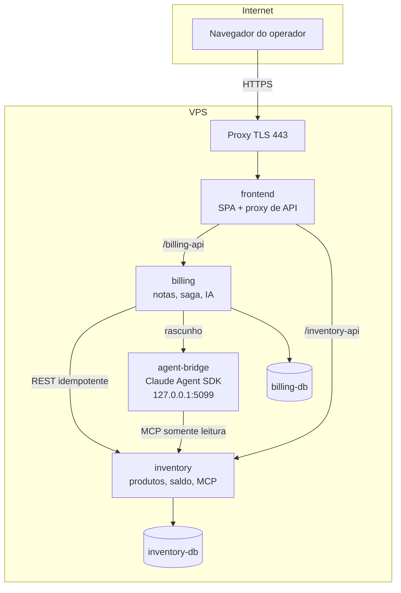

# Plano — Assistente com agente Claude hospedado em VPS

> **Status:** proposta para decisão. Nada deste documento está implementado.
> **Data:** 19/08/2026 · **Revisão:** 2 (adversarial, conferida contra o código)
> **Escopo:** substituir o provedor de IA do Copiloto por um agente Claude
> executando em VPS, preservando integralmente os controles de segurança.

---

## 1. Problema

O Copiloto depende hoje da OpenAI Responses API, configurada por
`OPENAI_API_KEY`. Sem a chave, o backend responde `AI_DISABLED` e o fluxo manual
segue funcionando — comportamento que **não muda** com este plano.

A restrição é de acesso: não há chave de API paga para o backend. A alternativa
proposta é executar um **agente Claude** numa VPS disponível em tempo integral,
consumindo o servidor MCP do Inventory para produzir o rascunho de nota.

---

## 2. Achado da revisão: a proveniência é auto-declarada pelo provedor

> A primeira versão deste plano afirmava que trocar o provedor preservaria todos
> os controles. A verificação mostrou que a situação é mais sutil — e exige
> trabalho antes da ponte.

### 2.1 O que de fato existe

A defesa central — *o ID final precisa ter sido descoberto via MCP* — **está** na
camada agnóstica de provedor:

```csharp
// services/billing/Application/AiDraftService.cs:103
if (!result.DiscoveredProductIds.Contains(item.ProductId))
    throw new DomainValidationException("A IA retornou um produto que não foi descoberto pelo catálogo.");
```

Trocar o provedor **não** remove essa checagem.

### 2.2 O problema: quem preenche o conjunto é o próprio provedor

`DiscoveredProductIds` faz parte do contrato de retorno (`AiContracts.cs:25`) e é
preenchido pelo provedor. No cliente OpenAI, ele nasce do catálogo montado a
partir dos resultados reais das ferramentas MCP:

```
CaptureProducts(result.Content, catalog)   OpenAiResponsesClient.cs:178,247-271
catalog.Keys.ToHashSet()                   OpenAiResponsesClient.cs:159
```

A checagem compartilhada é, portanto, tão forte quanto a honestidade do provedor
ao montar esse conjunto. **Nada no tipo, na interface ou em teste obriga** uma
implementação nova a preenchê-lo a partir de resultados MCP verificados.

Uma ponte que devolvesse, por conveniência, todos os IDs consultados — ou o
catálogo inteiro — faria a validação **passar vazia**. O fluxo continuaria
funcionando, os rascunhos continuariam plausíveis, e nenhum teste acusaria.

É uma armadilha de implementação, não uma falha atual.

### 2.3 O que realmente se perde na troca

Estes controles são locais ao cliente OpenAI e **não** têm equivalente
compartilhado:

| Controle | Arquivo | Efeito da perda |
|---|---|---|
| Teto de chamadas de ferramenta (`MaxToolCalls`, padrão 8) | `OpenAiResponsesClient.cs:82,165` | Execução sem limite de iterações |
| `get_product` restrito a ID já descoberto | `OpenAiResponsesClient.cs:361` | Sondagem livre do catálogo |
| `check_availability` com teto de itens distintos | `OpenAiResponsesClient.cs:376` | Consulta em massa |
| Rejeição antecipada de ID desconhecido | `OpenAiResponsesClient.cs:123-124` | Falha mais tarde (a rede compartilhada ainda pega) |

Na camada agnóstica sobram: proveniência (2.1), teto de 20 itens e faixa de
quantidade (`AiDraftService.cs:97-102`).

### 2.4 Consequência para o plano

Antes da ponte, dois trabalhos:

1. **Tornar o contrato de proveniência explícito** — documentar em
   `IInvoiceDraftAiClient` que `DiscoveredProductIds` só admite IDs vindos de
   resultado MCP da mesma execução, e cobrir com teste que um provedor
   "generoso" seja detectado.
2. **Mover os tetos para a camada compartilhada** — número de chamadas e
   validação de argumento por ferramenta devem valer para qualquer provedor.

Isso vira a **Fase 1**, bloqueante.

## 3. Decisão central: trocar o provedor atrás de uma costura saneada

O Billing consome `IInvoiceDraftAiClient`, hoje implementada por
`OpenAiResponsesClient`. O agente Claude será uma segunda implementação,
selecionada por configuração — **depois** do trabalho da seção 2.4.

Controles que precisam valer para **qualquer** provedor:

- proveniência: todo ID final foi visto num resultado MCP da mesma execução —
  hoje garantida, mas com o contrato implícito descrito em 2.2;
- teto de chamadas de ferramenta (hoje só no cliente OpenAI);
- restrição de argumentos por ferramenta (hoje só no cliente OpenAI);
- disponibilidade derivada no servidor, nunca a alegada pelo modelo;
- agregação de duplicatas e teto de quantidade;
- ação proposta assinada em HMAC, com prazo e confirmação validada no servidor;
- revalidação completa no momento de executar;
- `AI_DISABLED` quando não configurado.

---

## 4. Topologia na VPS



**Regra de exposição:** apenas `443` sai para a internet. APIs, bancos e ponte
permanecem em rede interna ou `127.0.0.1`.

---

## 5. Modelo de segurança

A VPS muda o risco: o serviço fica de pé o tempo todo e é alcançável a partir de
uma aplicação exposta à internet.

### 5.1 O agente não pode escrever

O Claude Agent SDK traz o harness do Claude Code, **com ferramentas de sistema de
arquivos e execução de comando**. Nada disso pode estar habilitado. A ponte
declara allowlist contendo somente as três ferramentas MCP de leitura:

```
search_products · get_product · check_availability
```

Sem Bash. Sem escrita em arquivo. Sem rede além do endpoint MCP.

### 5.2 O agente propõe; o servidor executa

O agente devolve um rascunho; o backend monta uma **ação proposta** assinada; a
interface mostra o que será feito; a execução ocorre só após confirmação humana,
com revalidação completa. Mesmo induzido a propor algo indevido, o agente não
efetiva nada.

### 5.3 Prompt injection é premissa

Descrição de produto vem do banco e é **texto não confiável**. A defesa não é
confiar no modelo: prompt de template fixo, allowlist de ferramentas, validação
determinística de proveniência e confirmação humana obrigatória.

### 5.4 O token interno na ponte — superfície ampliada

Para falar com `/mcp`, a ponte precisa do `INTERNAL_SERVICE_TOKEN`. Isso cria um
**terceiro detentor** do segredo mais crítico do sistema, fora dos dois serviços.

O agravante é que hoje **um único token** libera três rotas
(`InternalServiceAuthenticationMiddleware.cs:52-55`):

```
/mcp  ·  /api/stock/debits  ·  /api/stock/reconciliation
```

Ou seja, a ponte precisaria de leitura via MCP, mas receberia junto o poder de
**debitar estoque diretamente** — exatamente o que todo o modelo de segurança
tenta impedir. Um agente comprometido contornaria a ação proposta assinada
chamando `/api/stock/debits` com o token que ele já tem.

Mitigação obrigatória: emitir um **token distinto com escopo apenas de MCP**,
separando a verificação hoje unificada. Sem isso, a ponte anula a própria defesa
descrita em 5.2.

### 5.5 Superfície da ponte

| Controle | Detalhe |
|---|---|
| Bind | `127.0.0.1:5099` — nunca `0.0.0.0` |
| Autenticação | segredo compartilhado, comparado em tempo constante |
| Contrato | endpoint único `POST /draft`, schema fechado |
| Concorrência | uma execução por vez, fila curta, rejeição explícita quando cheia |
| Timeout | teto por execução, resposta tipada ao Billing |
| Logs | sem prompt bruto, imagem, credencial ou raciocínio do modelo (**INV-22**) |

---

## 6. Lacunas funcionais a resolver

### 6.1 Imagem

O fluxo atual aceita imagem: multipart, até 5 MiB, JPEG/PNG/WebP, validada por
magic bytes e reencodada com SkiaSharp. **Não está definido como a imagem chega
ao agente.** Se a ponte não suportar entrada visual, o atalho "Ler de uma foto"
quebra silenciosamente nesse provedor.

Decisão necessária: suportar imagem na ponte, ou desabilitar o atalho quando o
provedor for `claude-bridge` — nunca deixar falhar sem explicação.

### 6.2 Rate limit por IP deixa de funcionar

Hoje o limite é de 5 requisições por minuto particionadas por
`Connection.RemoteIpAddress` (`Program.cs:73-80`). Atrás de um proxy na VPS esse
endereço é o **do próprio proxy**: todos os usuários caem no mesmo balde e cinco
requisições de qualquer um bloqueiam todo mundo.

Agora que existe autenticação, o caminho correto é **limitar por usuário**, e
configurar forwarded headers com proxies confiáveis.

### 6.3 Migrations automáticas no start

`Database:MigrateOnStartup` é `true`. Em ambiente descartável, é conveniente; com
dados reais na VPS, migration automática na subida é arriscada. Avaliar aplicar
migrations como passo explícito de implantação.

### 6.4 Usuários semeados com senha pública

O seeding cria `operador` e `supervisor` com a mesma senha fixa no código
(`services/billing/Program.cs:132-133`) — correto para ambiente demonstrativo
local, inaceitável numa VPS alcançável pela internet. É **bloqueador de
implantação**, não observação.

O seeding é condicionado ao ambiente, mas a senha estar no código-fonte significa
que qualquer pessoa com acesso ao repositório a conhece.

---

## 7. Autenticação em servidor headless

Os SDKs resolvem credenciais nesta ordem: `ANTHROPIC_API_KEY` →
`ANTHROPIC_AUTH_TOKEN` → perfil OAuth de `ant auth login` → Workload Identity
Federation → perfil padrão em disco.

Numa VPS sem navegador, `ant auth login` exige um fluxo que **precisa ser
verificado antes de assumirmos que funciona**. Este é o principal risco de
viabilidade e é validado na Fase 0.

### 7.1 A pergunta que decide o plano

A premissa original era "não tenho API paga". Com uma VPS paga rodando em tempo
integral, ela merece revisão honesta:

| Cenário | Caminho correto |
|---|---|
| Credencial na VPS é **chave de API** | **Usar a API direta.** Sem ponte, sem harness, sem serviço extra — mais simples, mais barato de manter |
| Credencial é **assinatura já paga**, e o uso está dentro dos termos | A ponte se justifica |
| Termos não permitem | Plano cai; volta para API direta |

Verificar os termos é pré-requisito. Assinatura pessoal alimentando o backend de
uma aplicação é uso diferente de uso interativo pessoal.

---

## 8. Componentes a implementar

| # | Componente | Onde | Descrição |
|---|---|---|---|
| 1 | **Contrato de proveniência + tetos compartilhados** | `services/billing/Application/` | Pré-requisito da seção 2.4; com testes próprios |
| 2 | `ClaudeBridgeClient` | `services/billing/Infrastructure/` | Implementa `IInvoiceDraftAiClient`; fala HTTP com a ponte |
| 3 | Seleção de provedor | `services/billing/Program.cs` | `AI:Provider` = `openai` \| `claude-bridge` \| vazio |
| 4 | `agent-bridge` | `tools/agent-bridge/` | Serviço Node com o Claude Agent SDK; fora da imagem Docker |
| 5 | Token MCP com escopo próprio | `services/inventory/.../Security/` | Seção 5.4 |
| 6 | Rate limit por usuário | `services/billing/Program.cs` | Seção 6.2 |
| 7 | Unidade systemd | `deploy/` | Serviço gerenciado, restart e limites |
| 8 | Compose de produção | `deploy/` | TLS, volumes persistentes, `extra_hosts` |

> **Nota:** as assinaturas exatas do Claude Agent SDK devem ser lidas da
> documentação oficial (`code.claude.com/docs/en/agent-sdk`) no momento de
> escrever o código. Não inferir API de memória nem de outros SDKs.

---

## 9. Provisionamento da VPS

### 9.1 Dimensionamento

A stack tem cinco contêineres mais o serviço da ponte. Dois PostgreSQL, duas
APIs .NET, nginx e um processo Node com o harness do agente.

| Recurso | Mínimo sugerido | Observação |
|---|---|---|
| vCPU | 2 | Build de imagem exige mais; considerar build fora da VPS |
| RAM | 4 GB | 2 GB é insuficiente com dois PostgreSQL e o agente |
| Disco | 40 GB | Imagens Docker + volumes + logs |
| SO | Linux com Docker Engine | |

### 9.2 Rede e firewall

| Porta | Exposição | Uso |
|---|---|---|
| 443 | pública | HTTPS |
| 80 | pública | redirecionamento e desafio ACME |
| 5001 / 5002 | `127.0.0.1` | APIs |
| 5099 | `127.0.0.1` | ponte |
| 5432 | rede Docker | bancos, sem publicação no host |

O `docker-compose.yml` atual já vincula portas a `127.0.0.1` — comportamento
correto também na VPS.

### 9.3 Segredos

- `INTERNAL_SERVICE_TOKEN` gerado no servidor, só no `.env`, fora do Git;
- token de MCP com escopo próprio (seção 5.4);
- segredo da ponte;
- credencial do agente fora do repositório e fora da imagem;
- **senhas dos usuários semeados trocadas** (seção 6.4).

### 9.4 Persistência e backup

Os volumes dos dois PostgreSQL precisam ser nomeados e incluídos em rotina de
backup. Hoje o ambiente é descartável; sem backup, um `down -v` perde tudo.

### 9.5 Implantação

Decisão em aberto: implantação manual por `git pull` + `compose up --build`, ou
pipeline a partir do `quality-gate` já existente. Build na própria VPS consome
CPU e memória — considerar registry.

---

## 10. Observabilidade

- correlation ID já propagado de ponta a ponta;
- logs da ponte com `aiDraftRunId`, duração, ferramentas chamadas e status;
- **nunca** prompt, imagem ou credencial;
- health check da ponte, para o Billing degradar para `AI_UNAVAILABLE` limpo;
- reconciliação de saldo (**INV-09**) executável na VPS como verificação
  periódica de consistência.

---

## 11. Fases

| Fase | Objetivo | Critério de saída | Bloqueante |
|---|---|---|---|
| **0** | Viabilidade de credencial e termos | Agente autentica na VPS e chama uma ferramenta MCP manualmente | **Sim** |
| **1** | Explicitar contrato de proveniência e mover tetos | Provedor "generoso" reprovado por teste; tetos fora do cliente OpenAI; OpenAI segue verde | **Sim** |
| **2** | Ponte mínima | `POST /draft` devolve rascunho válido a partir de texto | |
| **3** | Integração | `ClaudeBridgeClient`; alternância por configuração | |
| **4** | Endurecimento | Allowlist, segredo, timeout, fila, logs sanitizados, token MCP com escopo | |
| **5** | Preparo da VPS | Dimensionamento, TLS, firewall, backup, senhas trocadas | **Sim** |
| **6** | Verificação | Cenários da seção 12 executados na VPS | |

As Fases 0, 1 e 5 são bloqueantes por motivos diferentes: viabilidade, segurança
e exposição pública.

---

## 12. Critérios de aceite

1. Sem provedor configurado, o Copiloto responde `AI_DISABLED` e o fluxo manual
   funciona integralmente.
2. Com a ponte fora do ar, o Billing responde `AI_UNAVAILABLE` sem derrubar a tela.
3. A ponte recusa requisição sem o segredo compartilhado.
4. A ponte não é alcançável de fora da VPS.
5. O agente não possui ferramenta de escrita; tentativa de uso é recusada.
6. Um ID de produto inventado é descartado com o provedor Claude.
7. **Um provedor que declare IDs não vindos de MCP é reprovado por teste** — o
   contrato de 2.2 deixa de ser implícito.
8. O teto de chamadas de ferramenta vale para ambos os provedores.
9. Descrição de produto com instrução maliciosa não altera comportamento nem
   vaza o prompt.
10. Nenhuma escrita ocorre sem ação proposta assinada e confirmada.
11. Logs não contêm prompt, imagem, credencial nem raciocínio do modelo.
12. Nenhum saldo é alterado por caminho que não passe pelo `StockDebitService`.
13. Rate limit funciona por usuário, não por IP do proxy.
14. Reconciliação de saldo não acusa divergência após uma bateria de fechamentos.

---

## 13. Riscos

| Risco | Impacto | Mitigação |
|---|---|---|
| **Proveniência auto-declarada** | Ponte "generosa" faz a validação passar vazia | Fase 1: contrato explícito e teste (seção 2.2) |
| Tetos locais ao cliente OpenAI | Ponte sem limite de iteração nem de argumento | Fase 1: mover para camada compartilhada |
| Credencial não viável em headless | Plano inteiro cai | Fase 0 bloqueante; alternativa é API direta |
| Termos do plano de assinatura | Uso indevido | Verificar antes de implantar |
| Harness com ferramentas amplas | Escrita indevida no servidor | Allowlist restrita a MCP de leitura |
| **Token único cobre MCP e débito** | Ponte comprometida debita estoque sem confirmação | Token com escopo só de MCP — bloqueante |
| Senhas semeadas públicas | Acesso indevido | Trocar antes de expor |
| Latência do agente | Interface travada | Timeout, carregamento, degradação tipada |
| Ponte como ponto único de falha | Copiloto indisponível | Health check e `AI_UNAVAILABLE` |
| Custo de serviço 24/7 mais tokens | Desperdício | Comparar com API direta (seção 7.1) |
| VPS pública amplia superfície | Exposição | Somente 443 aberto; autenticação da aplicação |
| Migration automática com dados reais | Perda ou bloqueio | Avaliar passo explícito |

---

## 14. Esforço estimado

| Fase | Ordem de grandeza |
|---|---|
| 0 — viabilidade | horas |
| 1 — contrato e tetos | 1 dia, com testes |
| 2 e 3 — ponte e integração | 1 a 2 dias |
| 4 — endurecimento | 1 dia |
| 5 — preparo da VPS | 1 dia |
| 6 — verificação | meio dia |

Estimativa de quem vai implementar, sem margem para imprevisto de credencial —
que é o item de maior variância.

---

## 15. Decisões em aberto

1. **Agent SDK ou modo headless da CLI?** Recomendação: **Agent SDK** — devolve
   mensagens estruturadas e é feito para uso programático.
2. **Rascunho-somente ou execução pelo agente?** Recomendação:
   **rascunho-somente**; a escrita continua pelo fluxo de ação confirmada.
3. **Assinatura ou chave de API na VPS?** Ver seção 7.1 — muda a justificativa do
   plano inteiro.
4. **Imagem na ponte:** suportar ou desabilitar o atalho? (seção 6.1)
5. **Implantação:** manual ou pipeline a partir do `quality-gate`? (seção 9.5)
6. **Domínio e TLS** — necessários para uso fora de `localhost`.

---

## 16. O que este plano não faz

- Não altera o fluxo manual, que continua sendo o caminho principal.
- Não remove o suporte à OpenAI; a seleção é por configuração.
- Não concede ao agente qualquer poder de escrita direta.
- Não substitui validação determinística por confiança no modelo.
- Não trata o Copiloto como requisito de funcionamento do sistema.

---

## Apêndice — como esta revisão foi feita

A revisão 1 foi conferida contra o código, não contra a memória de quem
escreveu. Cada afirmação abaixo tem origem verificada:

| Afirmação | Origem |
|---|---|
| Proveniência existe na camada compartilhada | `AiDraftService.cs:103` |
| O conjunto é preenchido pelo provedor | `AiContracts.cs:25`, `OpenAiResponsesClient.cs:159` |
| Teto de chamadas é local ao cliente OpenAI | `OpenAiResponsesClient.cs:82,165`; padrão 8 em `AppOptions.cs:20` |
| Um token cobre MCP, débito e reconciliação | `InternalServiceAuthenticationMiddleware.cs:52-55` |
| Rate limit particiona por IP de conexão | `Program.cs:73-80` |
| Imagem: 5 MB, 12 MP, JPEG/PNG/WebP, reencode | `AiDraftService.cs:108-136` |
| Migration automática na subida | `appsettings.json:7`, `Program.cs:114` |
| Senha de seeding fixa no código | `Program.cs:132-133` |
| Portas já vinculadas a `127.0.0.1` | `docker-compose.yml:46,72,89` |

Duas afirmações da revisão 1 foram **derrubadas** por essa conferência:

1. *"Trocar de provedor perde a validação de proveniência"* — falso; a validação
   é compartilhada. O problema real é o contrato implícito (seção 2.2).
2. *"A senha de seeding está documentada no README"* — falso; ela está fixa no
   código-fonte, e o README não documenta as credenciais de acesso.

Segue **não verificado**, por depender de fonte externa: o comportamento de
autenticação headless do agente e os termos de uso aplicáveis (seção 7). É por
isso que a Fase 0 é bloqueante.
